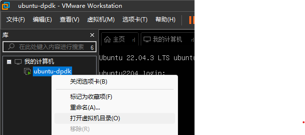
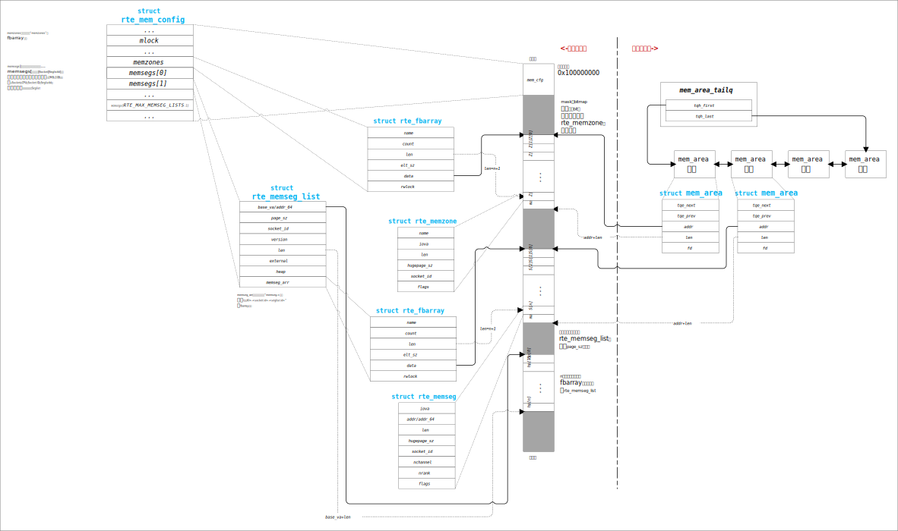

- [DPDK](#dpdk)
  - [安装环境](#安装环境)
    - [虚拟机配置](#虚拟机配置)
    - [Ubuntu 系统配置](#ubuntu-系统配置)
  - [内存布局](#内存布局)

# DPDK

本项目是对 DPDK 的源码的分析笔记。基于 dpdk 22.11.4 版本。


## 安装环境


### 虚拟机配置

* 使用 VMware 创建虚拟机

  > 虚拟机创建后默认有一张网卡，该网卡用于组网，SSH 访问。还需要额外添加两张网卡，用于运行 DPDK。

* 修改网卡驱动

  * 打开虚拟机所在目录

    

  * 使用记事本编辑 `.vmx` 后缀的文件，修改以下两项

    ```text
    ethernet1.virtualDev = "vmxnet3"
    ethernet1.vwakeOnPcktRcv = "TRUE"
    ethernet2.virtualDev = "vmxnet3"
    ethernet2.vwakeOnPcktRcv = "TRUE"
    ```

    > VMware 配置中的网卡是从 0 开始编号的。


### Ubuntu 系统配置

* 安装 `igb_uio` 驱动

  ```bash
  sudo apt install dpdk-kmods-dkms
  ```

  > 这里选择从 ubuntu 软件源下载 `igb_uio` 驱动。如果系统是 UEFI 安全启动，自己编译驱动需要进行签名、部署、设置 MOK 等操作，后面介绍如何编译 `igb_uio`。

  将 `igb_uio` 设置为启动时自动加载

  ```bash
  sudo bash -c 'echo igb_uio >> /etc/modules'
  ```

  

* 禁用 DPDK 测试网卡的 DHCP

  测试网卡在 ubuntu 上启用了 DHCP，做为组网网卡用了，DPDK 无法绑定存在于路由表中的网卡。ubuntu 22.04 使用 `netplat` 管网络，修改 `netplan` 配置文件 `/etc/netplan/00-installer-config.yaml`

  ```yaml
  # This is the network config written by 'subiquity'
  network:
    ethernets:
      ens160:
        dhcp4: false
      ens192:
        dhcp4: false
      ens33:
        dhcp4: true
    version: 2
  ```

  > 注意缩进。网卡名按实际情况确定。

  重置网络

  ```bash
  sudo netplan apply
  ```

  

* 设置大页

  DPDK 需要一定数量大页内存，系统默认开启了 2MB 的大页，通过以下方法可以临时分配大页：

  ```bash
  sudo bash -c 'echo 512 >/sys/kernel/mm/hugepages/hugepages-2048kB/nr_hugepages'
  ```

  > 分配了 512 * 2MB 的大页

  也可以设置启动时自动预留大页，修改 `/etc/default/grub` 文件中 `GRUB_CMDLINE_LINUX_DEFAULT` 的值

  ```txt
  GRUB_CMDLINE_LINUX_DEFAULT="default_hugepagesz=1G hugepagesz=1G hugepages=2"
  ```

  > 参数说明：
  >
  > * `default_hugepagesz=1G` 设置默认大页为 1GB
  > * `hugepagesz=1G` 开启 1GB 大页
  > * `hugepages=2` 在启动时预留两个大页

  更新 grub 配置，并重启

  ```bash
  sudo update-grub
  reboot
  ```

  

* 检测驱动和大页

  重启后检查 `igb_uio` 驱动是否自动加载

  ```bash
  lsmode | grep igb_uio
  ```

  检查大页

  ```bash
  cat /proc/meminfo | grep HugePages
  ```


## 内存布局

内存布局就是地图，有了地图才能按图索骥。DPDK 初始化函数是 `rte_eal_init()`，完成初始化之后内存布局如下：



* DPDK 的共享内存默认起始地址为 `0x100000000`，通过 EAL 参数 `--base-virtaddr` 可以设置起始地址。`primary` 和 `secondary` 进程使用相同的起始地址，因此它们可以跨进程使用共享内存中的虚拟地址。
* `mem_cfg` 是文件 `/run/dpdk/rte/config` 的内存映射，它保存了内存的配置信息
* `rte_fbarray` 是一个对象池管理器，它由对象数组和 `mask` 组成
  * 对象可以是任意类型，在初始化时设置好对象的大小和数量
  * `mask` 是一个 BitMap 类型的数据，纪录着哪些位置上的对象已经分配
  * 在进程的私有内存区域中，`mem_area_tailq` 链表保存着当前在当前进程创建的 `rte_fbarray`
* `mem_cfg.memzones` 保存着 `rte_memzone_reserve` 分配的内存区域的描述信息，最大支持 `RTE_MAX_MEMZONE` 个内存区域
* `memsegs[]` 数组保存着各 NUMA 结点的大页信息
  * `memsegs[]` 实际是一个三维数组：大页类型数量、NUMA 数量、SegList 数量
    * 大页类型数量：该维度的长度是系统支持的大页类型的数量。例如，系统支持 256K，2M，1G，则维度是 3
    * NUMA 数量：系统上 NUMA 结点的数量。NUMA 是一种内存访问的硬件架构，常见于服务器上。在 NUMA 架构下，CPU 的内存分为本地和远程两种。本地内存是与 NUMA 直接相连接的内存，而远程内存是与其它 NUMA 相连接的内存。访问本地内存的速通常较快。
    * SegList 数量：每个分段设计了最大内存上限，因此分成多个 SegList
  * `memsegs[i]` 中保存着大页内存段列表的开始位置和一个纪录着大页信息的 `rte_fbarray` 对象
    * `memseg_arr` 是一个由若干个 `rte_memseg` 对象组成的 `rte_fbarray` 对象池，每个 `rte_memseg` 对象描述一个大页的信息
    * 在 `memseg_arr` 所指向的 `rte_fbarray` 内存之后，向上对齐到大页大小的地址是若干个大页内存段的开始地址
