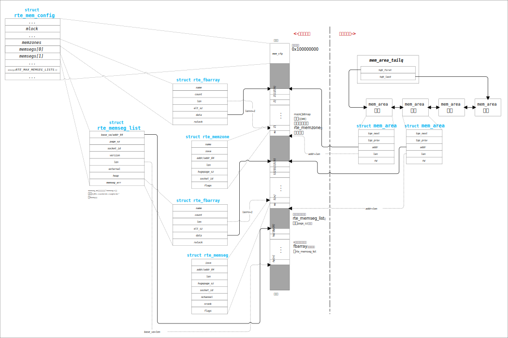

- [DPDK](#dpdk)
  - [安装环境](#安装环境)
    - [虚拟机配置](#虚拟机配置)
    - [Ubuntu 系统配置](#ubuntu-系统配置)
  - [编译 DPDK](#编译-dpdk)
  - [内存布局](#内存布局)
  - [内存分配](#内存分配)
    - [heap](#heap)
    - [fbarray](#fbarray)
    - [memzone](#memzone)
    - [mempool](#mempool)


# DPDK

本项目是对 DPDK 的源码的分析笔记。基于 dpdk 22.11.4 版本。


## 安装环境


### 虚拟机配置

* 使用 VMware 创建虚拟机

  > 虚拟机创建后默认有一张网卡，该网卡用于组网，SSH 访问。还需要额外添加两张网卡，用于运行 DPDK。

* 修改网卡驱动

  * 打开虚拟机所在目录

    

  * 使用记事本编辑 `.vmx` 后缀的文件，修改以下两项

    ```text
    ethernet1.virtualDev = "vmxnet3"
    ethernet1.vwakeOnPcktRcv = "TRUE"
    ethernet2.virtualDev = "vmxnet3"
    ethernet2.vwakeOnPcktRcv = "TRUE"
    ```

    > VMware 配置中的网卡是从 0 开始编号的。


### Ubuntu 系统配置

* 安装 `igb_uio` 驱动

  ```bash
  sudo apt install dpdk-kmods-dkms
  ```

  > 这里选择从 ubuntu 软件源下载 `igb_uio` 驱动。如果系统是 UEFI 安全启动，自己编译驱动需要进行签名、部署、设置 MOK 等操作，后面介绍如何编译 `igb_uio`。

  将 `igb_uio` 设置为启动时自动加载

  ```bash
  sudo bash -c 'echo igb_uio >> /etc/modules'
  ```


* 禁用 DPDK 测试网卡的 DHCP

  测试网卡在 ubuntu 上启用了 DHCP，做为组网网卡用了，DPDK 无法绑定存在于路由表中的网卡。ubuntu 22.04 使用 `netplat` 管网络，修改 `netplan` 配置文件 `/etc/netplan/00-installer-config.yaml`

  ```yaml
  # This is the network config written by 'subiquity'
  network:
    ethernets:
      ens160:
        dhcp4: false
      ens192:
        dhcp4: false
      ens33:
        dhcp4: true
    version: 2
  ```

  > 注意缩进。网卡名按实际情况确定。

  重置网络

  ```bash
  sudo netplan apply
  ```


* 设置大页

  DPDK 需要一定数量大页内存，系统默认开启了 2MB 的大页，通过以下方法可以临时分配大页：

  ```bash
  sudo bash -c 'echo 512 >/sys/kernel/mm/hugepages/hugepages-2048kB/nr_hugepages'
  ```

  > 分配了 512 * 2MB 的大页

  也可以设置启动时自动预留大页，修改 `/etc/default/grub` 文件中 `GRUB_CMDLINE_LINUX_DEFAULT` 的值

  ```txt
  GRUB_CMDLINE_LINUX_DEFAULT="default_hugepagesz=1G hugepagesz=1G hugepages=2"
  ```

  > 参数说明：
  >
  > * `default_hugepagesz=1G` 设置默认大页为 1GB
  > * `hugepagesz=1G` 开启 1GB 大页
  > * `hugepages=2` 在启动时预留两个大页

  更新 grub 配置，并重启

  ```bash
  sudo update-grub
  reboot
  ```


* 检测驱动和大页

  重启后检查 `igb_uio` 驱动是否自动加载

  ```bash
  lsmode | grep igb_uio
  ```

  检查大页

  ```bash
  cat /proc/meminfo | grep HugePages
  ```


## 编译 DPDK

* 下载 DPDK 源码

  - https://fast.dpdk.org/rel/dpdk-22.11.4.tar.xz

  ```bash
  wget https://fast.dpdk.org/rel/dpdk-22.11.4.tar.xz
  ```


* 安装依赖

  ```bash
  sudo apt install \
    meson \
    ninja-build \
    gdb \
    gcc \
    pkg-config \
    python3-pyelftools \
    libpcap-dev \
    libnuma-dev \
    libbsd-dev \
    libssl-dev \
    libjansson-dev \
    libarchive-dev \
    doxygen \
    libcrypt-dev \
    cmake \
    zlib1g-dev \
    libelf-dev \
    libbpf-dev
  ```


* 编译 & 安装

  ```bash
  tar xf dpdk-22.11.4.tar.xz
  cd dpdk-stable-22.11.4
  meson build --buildtype=debug
  ninja -C build install
  ```

  > * 通过 `meson confiugre build` 可以查看配置
  > * 编译为 Debug 版本，便于后面调试分析


* 测试

  * 编写一个简单的测试代码 `test-dpdk.c`

    ```c
    #include <rte_eal.h>
    
    int main(int argc, char ** argv) {
        int err = rte_eal_init(argc, argv);
        if (err < 0) {
            return -1;
        }
    
        return 0;
    }
    ```

  * 编译 & 运行

    ```bash
    gcc -g test-dpdk.c -lrte_eal
    ./a.out
    ```


## 内存布局

内存布局就是地图，有了地图才能按图索骥。DPDK 初始化函数是 `rte_eal_init()`，完成初始化之后内存布局如下：



* DPDK 的共享内存默认起始地址为 `0x100000000`，通过 EAL 参数 `--base-virtaddr` 可以设置起始地址。`primary` 和 `secondary` 进程使用相同的起始地址，因此它们可以跨进程使用共享内存中的虚拟地址。
* `mem_cfg` 是文件 `/run/dpdk/rte/config` 的内存映射，它保存了内存的配置信息
* `rte_fbarray` 是一个对象池管理器，它由对象数组和 `mask` 组成
  * 对象可以是任意类型，在初始化时设置好对象的大小和数量
  * `mask` 是一个 BitMap 类型的数据，纪录着哪些位置上的对象已经分配
  * 在进程的私有内存区域中，`mem_area_tailq` 链表保存着当前在当前进程创建的 `rte_fbarray`
* `mem_cfg.memzones` 保存着 `rte_memzone_reserve()` 分配的内存区域的描述信息，最大支持 `RTE_MAX_MEMZONE` 个内存区域
* `memsegs[]` 数组保存着各 NUMA 结点的大页信息
  * `memsegs[]` 实际是一个三维数组：大页类型数量、NUMA 数量、SegList 数量
    * 大页类型数量：该维度的长度是系统支持的大页类型的数量。例如，系统支持 256K，2M，1G，则维度是 3
    * NUMA 数量：系统上 NUMA 结点的数量。NUMA 是一种内存访问的硬件架构，常见于服务器上。在 NUMA 架构下，CPU 的内存分为本地和远程两种。本地内存是与 NUMA 直接相连接的内存，而远程内存是与其它 NUMA 相连接的内存。访问本地内存的速通常较快。
    * SegList 数量：每个分段设计了最大内存上限，因此分成多个 SegList
  * `memsegs[i]` 中保存着大页内存段列表的开始位置和一个纪录着大页信息的 `rte_fbarray` 对象
    * `memseg_arr` 是一个由若干个 `rte_memseg` 对象组成的 `rte_fbarray` 对象池，每个 `rte_memseg` 对象描述一个大页的信息
    * 在 `memseg_arr` 所指向的 `rte_fbarray` 内存之后，向上对齐到大页大小的地址是若干个大页内存段的开始地址


## 内存分配

### heap

* **heap 的成员**
  * `malloc_heaps[]` 数组的长度默认是 `RTE_MAX_HEAPS`，线程按运行时所在 NUMA 结点选择对应的 heap
  * `malloc_heaps[i].name[]` 保存着 heap 的名称，以 NUMA ID 命名
  * `malloc_heaps[i].socket_id` 实际是 NUMA ID

  

* **heap 的扩展**

  * 分配大页

    在初始状态时，所有的 heap 下都没有内存，当调用内存分配函数 `rte_malloc()` 时，会尝试扩展 heap。线程从运行所在的 NUMA 结点的 `memsegs[]` 下选择合适大页大小的 `memsegs[]` 元素，从该元素的 `rte_fbarray` 对象池（`memsegs[i].memseg_arr`）中分配合适数量的 `rte_memseg` 对象，`rte_meseg` 对象的创建伴随着大页的创建，并纪录大页的信息。

    

  * 添加大页到 heap 中

    大页分配之后，在大页内存开始地址处构造一个 `malloc_elem` 对象，添加到对应 NUMA 所在的 `malloc_heaps[]` 中。

    

    * 每个 heap 对象包含一个 `free_head[]` 数组，默认长度是 13，它们按大小范围将未使用的内存块用链表串起来，`free_head[]` 大小范围按以下方式分配：

      ```
      heap->free_head[0] - (0   , 2^8]
      heap->free_head[1] - (2^8 , 2^10]
      heap->free_head[2] - (2^10, 2^12]
      heap->free_head[3] - (2^12, 2^14]
      ...
      heap->free_head[11] - (2^28, 2^30]
      heap->free_head[12] - (2^30, MAX_SIZE]
      ```

      > 分配1GB 大页后，将被添加到 `free_head[11]` 中

    * `heap[i].first` 和 `heap[i].last` 用于连接该 heap 下所有内存块（包括已分配和未分配）的链表头和尾，并且链表是按地址顺序排列。

  

* **从 heap 中分配内存**

  * 通过调用 `rte_malloc()` 线程所在的 NUMA ID，找到 `heap[i]`

  * 分配内存的大小向上对齐到 Cachel Line 大小，找到合适大小的 `heap[i].free_head[j]`，如果 `free_head[j]` 没有足够内存，继续寻找下一个大小 `free_head[j]`，返回该链表下第一个可以容纳所需大小的内存块地址，即 `malloc_elem` 地址

  * 检查找到的 `malloc_elem` 内存大小是否满足分裂成两个 `malloc_elem` 的条件，即能够容纳以下三部分：

    * `malloc_elem` 头部，即 `sizeof (struct malloc_elem)`
    * `MIN_DATA_SIZE`，是一个 Cache Line 大小
    * `MALLOC_ELEM_TRAILER_LEN`，通常是 0，如果打开了内存检测宏 `RTE_MALLOC_ASAN`，则是一个 Cache Line 大小

    根据分裂检查结果执行：

    * 不满足分裂条件，则该内存块的 `malloc_elem` 头部之后的地址即是最终的分配地址，将该 `malloc_elem` 从 `free_head[j]` 链表中摘除
    * 满足分裂条件，将该 `malloc_elem` 从 `free_head[j]` 链表中摘除，从该 `malloc_elem` 内存块的尾部，将其分裂成两个 `malloc_elem`，设这两块为 A 和 B，分裂步骤如下：
      1. A 的 `malloc_elem` 就是分裂前的头，需要变更内存块大小
      2. B 的 `malloc_elem.orig_elem` 设置为 A 的 `malloc_elem.orig_elem`，使得所有分裂出来的 `malloc_elem` 都通过 `orig_elem` 字段指向分裂的源头
      3. B 通过 `malloc_elem.prev` 和 `malloc_elem.next`挂接到 A 的后面，使得所有分裂出来的内存块是按地址大小顺序串起来的，便于在释放的时候合并邻近的内存块
      4. 设置 B 内存块的大小，状态等其它字段
      5. B 的 `malloc_elem` 头部之后的地址即最终的分配地址

  

* **heap 释放内存**

  * 释放内存地址向前偏移 `sizeof (struct malloc_elem)` 大小，即是 `malloc_elem` 头部
  * 按线程运行时所在的 NUMA，找到 `heap[i]`
  * 尝试合并 `malloc_elem.prev` 和 `malloc_elem.next` 前后的内存块，合并原则是地址是连续，且属于同一 `memsegs[]` 元素，即 `melloc_elem.msl` 相等
  * 若不能合并，则按内存块大小放入合适的 `free_head[j]` 中


以下是个经过多次分配释放的 heap 示意图：


* `free_head[i]` 下有一个空闲内存块 `elem 0`
* `free_head[j]` 下有两个空闲内存块 `elem 2` 和 `elem 3`
* `elem 1` 和 `elem 4` 的 `free_list` 都没有连接链表，它们是已经分配出去的内存块
* `elem 0 ~ 2` 颜色相同，属于同一块大页，分裂源头是 `elem 0`
* `elem 3 ~ 4` 属于另一块大页，分列源头是 `elem 3`


### fbarray

TODO


### memzone


`heap` 是匿名的内块，而 `memzone`  是命名的 `heap` 内存块，通过名称可以跨进程查找。`memzone` 是由 `rte_memzone` 类型对象构成的 `rte_fbarray` 对象池。分配 `memezone` 的流程如下：

* 从 `rte_fbarray` 对象池中分配一个 `rte_memzone` 对象（参考 `fbarray`）
* 从 `heap` 上分配参数指定大小的内存块
* 内存块地址保存到 `rte_memzone.addr`
* `rte_memzone.name` 保存 `memzone` 的名称，该名称可用于查找


### mempool


* **`mempool` 的创建**

  * 在 `heap` 上分配 `struct rte_tailq_entry` 类型的对象，即上图中的 `te` 内存块，`te.data` 成员保存着 `mempool` 对象的指针。因此，通过 `mem_cfg.tailq_head[].name` 找到值为 `"RTE_MEMPOOL"`的链表，遍历所有 `te` 即可找到所有的 `mempool` 对象。
  * 计算 `mempool` 对象的大小，`mempool` 对象的内存由以下几部分组成：
    * `struct rte_mempool` 结构
    * 如果 `cache_size` 参数不为零，则包含 `RTE_MAX_LCORE` 个 `struct rte_mempool_cache` 对象
    * 如果 `private_data_size` 参数不为零，则包含 `private_data_size` 大小的预留空间
    * 对齐到 Cache Line 后产生的内存空洞
  * 在 `memzone` 上分配 `mempool` 对象的内存（参考 `memzone` 章节）
  * 设置 `mempool` 的各字段：`memzone` 的地址，对象数量，对象大小，缓存大小，私有数据大小等等
  * 设置 `mempool` 的操作函数集合，`mempool` 是将池中的对象指针保存在 `ring` 中，通过 `ring` 的出队，入队操作来完成分配（出队）和释放（入队）。根据创建 `mempool` 时的参数，有以下几种操作函数集合：
    * `ring_sp_sc`：单生产者（释放）、单消费者（分配）
    * `ring_sp_mc`：单生产者（释放）、多消费者（分配）
    * `ring_mp_sc`：多生产者（释放）、单消费者（分配）
    * `ring_mp_mc`：多生产者（释放）、多消费者（分配）

  > `rte_tailq_elem_head` 链表中的各个结点是声明在各模块中的静态全局变量，通过 `__attribute__((constructor))` 属性的函数，在模块加载时将结点挂接到 `rte_tailq_elem_head` 中。`rte_tailq_elem_head` 的每一个结点的代表一类资源，通过结点的 `head` 成员指向 `mem_cfg.tailq_head[]` 中的一项元素，`mem_cfg.tailq_head[]` 是各类资源对象的链表组成的数组。`head` 指向 `mem_cfg.tailq_head[]` 的关联过程是在 `rte_eal_init() -> rte_eal_tailqs_init()` 过程中完成的：
  >
  > * 若为 `primary` 进程：
  >   * 则从 `mem_cfg.tailq_head[]` 中分配一项
  >   * 设该类资源链表的名称： `rte_tailq_elem.name` 复制到 `rte_tailq_head.name`
  >   * 设置 `rte_tailq_elem.head` 为分配的 `rte_tailq_head`
  > * 若为 `secondary` 进程：
  >   * 找到 `rte_tailq_elem` 和 `mem_cfg.tailq_head[]` 中有相同名称的项
  >   * 设置 `rte_tailq_elem.head` 为分配的 `rte_tailq_head`


从 `mempool` 中分配对象的流程：

TODO
